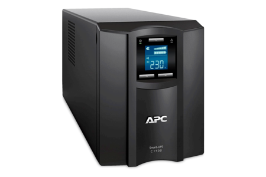

# T02: Selecció d’un SAI per una empresa client

---

## Informe tècnic: selecció de SAI per a TecnoGestió S.L

**Nom:** Biel Pérez Alonso  
**Curs:** 2B  
**Mòdul:** Seguretat Informàtica  
**Data:** 13/10/2025 (Erasmus)  

---

## Índex

1. [Inventari d’equips](#1-inventari-dequips)  
2. [Càlcul de potència total](#2-potència-total-amb-reserva)  
3. [Determinació de l’autonomia](#3-determinació-de-lautonomia)  
4. [Recerca de models de SAI](#4-recerca-de-models-de-sai)  
5. [Justificació del model escollit](#5-justificació-del-model-escollit)  
6. [Conclusió](#6-conclusió)

---

## Descripció del cas

L’empresa **TecnoGestió S.L.**, dedicada a la gestió documental i assessorament informàtic, té un petit despatx amb **4 ordinadors de sobretaula**, una **impressora-fotocopiadora multifunció** (similar a les que té l’escola) i un **router d’accés a Internet**.  

Davant les constants incidències amb el subministrament elèctric a la zona, la direcció ha decidit adquirir un **SAI** per garantir la continuïtat del servei i protegir els equips.

---

## 1. Inventari d’equips

**Equips existents:**
- 4 ordinadors de sobretaula  
- 4 monitors  
- 1 impressora multifunció *(no connectada al SAI)*  
- 1 router  

### Consulta d’especificacions tècniques (consum)

| Equip | Model orientatiu | Consum (W) | Potència aparent (VA ≈ W ÷ 0,8) |
|--------|------------------|-------------|----------------------------------|
| PC de sobretaula | Dell Optiplex 7010 | 200 W | 250 VA |
| Monitor | HP 24mh | 30 W | 38 VA |
| Router | TP-Link Archer C6 | 10 W | 13 VA |

**Càlcul total:**
- PC: 200 W × 4 = **800 W**  
- Monitors: 30 W × 4 = **120 W**  
- Router: **10 W**  
**Total en W = 930 W**  
**Total en VA = 930 ÷ 0,8 = 1162,5 VA**

---

## 2. Potència total amb reserva

S’aplica una **reserva del 20%** per seguretat:

- Total en W amb reserva = 930 + 186 = **1116 W**  
- Total en VA amb reserva = 1162,5 + 232,5 = **1395 VA**

---

## 3. Determinació de l’autonomia

L’autonomia mínima requerida és de **10 minuts**, per tal de **guardar treballs i apagar correctament els equips** en cas de tall elèctric.

---

## 4. Recerca de models de SAI

| Model | Potència (VA/W) | Autonomia | Sortides | Preu aprox. | Marca |
|--------|------------------|------------|-----------|--------------|--------|
| **APC Back-UPS Pro BR1500G** | 1500 VA / 865 W | 10–13 min | 6 Schuko | 260 € | APC |
| **Eaton Ellipse PRO 1600** | 1600 VA / 1000 W | 10 min | 8 Schuko | 250–300 € | Eaton |
| **Salicru SPS SOHO+ 1600** | 1600 VA / 960 W | 12 min | 6 Schuko | 230 € | Salicru |

---

## 5. Justificació del model escollit

S’ha escollit el **Eaton Ellipse PRO 1600** perquè:
- Ofereix la **potència necessària (1600 VA)**.  
- Té una **autonomia d’uns 10 minuts**.  
- Disposa de **diverses preses Schuko**.  
- Presenta un **bon equilibri entre qualitat i preu**.  
- És una **marca reconeguda per la seva fiabilitat** en entorns d’oficina.

---

## 6. Conclusió

El model **Eaton Ellipse PRO 1600** és la millor opció per a **TecnoGestió S.L.**, ja que assegura la continuïtat del servei davant talls elèctrics, protegeix els equips crítics i compleix amb els requisits de potència, autonomia i qualitat del projecte.

[Torna a l'enunciat](README.md)
