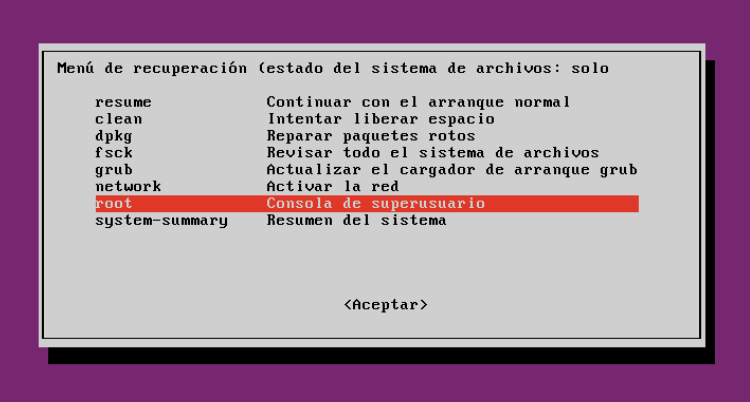
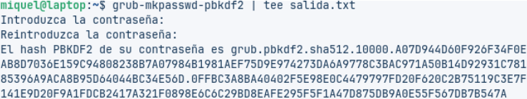

# Tasca 3: Recuperant accés a sistemes

## Part 1: Canvi contrasenya

Mentre s’inicia la màquina apretem Shift + qualsevol lletra, i se’ns obrirà aquest panell, prenem a “Advanced options for Zorin”.

Després anem a la segona opció i esperem.

Baixem fins arribar a root i prenem enter.

Escrivim mount -rw -o remount / per poder canviar la contrasenya del usuari.

Després cat /etc/passwd | grep “miquel” i ja sabem que l’usuari que hem d’utilitzar es “miquel” pel canvi de contrasenya.

Escrivim passwd miquel i fiquem la nova contrasenya q vulguem i ja estarà la contrasenya actualitzada.

Després obrim la màquina un altre cop en versió normal, introduïm la contrasenya nova i ja entrem.

## Part 2: Fortificar GRUB

Per començar la fortificació del GRUB, obrim terminal desde l’ordinador i introduïm el següent text: “grub-mkpasswd-pbkdf2”, i després introduïm la contrasenya.
Això serveix per generar un hush a partir d’una contrasenya.

Després fiques “grub-mkpasswd-pbkdf2 | tee salida.txt” per permitir redirigir la sortida estándar cap a un arxiu.

Ara fiquem “sudo nano -F /etc/grub.d/40_custom”, per afegir l'autentificació, més la contrasenya (usuari12345).

A continuació introduïm el següents textos més el hush creat anteriorment, i ho guardem amb Control+X, després Control+Y i Enter.

I per últim introduïm “sudo grub-mkconfig -o /boot/grub/grub.cfg”, per guardar la configuració, i ara reiniciem la màquina per veure si s’ha aplicat la fortificació.

Al entrar en sortirà que has d'introduir les següents dos coses, simplement introdueixes l’usuari+contrasenya que acabem de configurar i fet.

